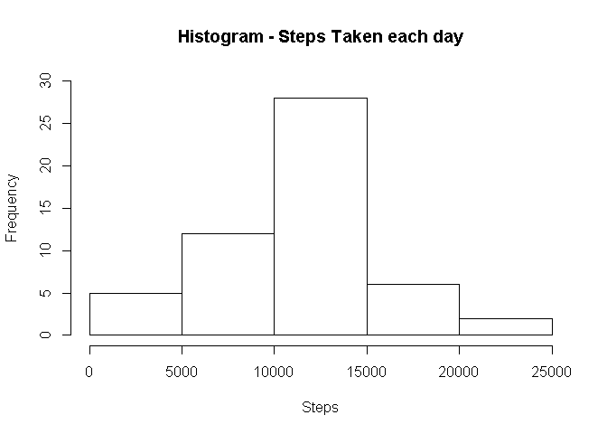

# **Acitivity Monitoring**
The following analysis is performed on **activity** data, which has the number of steps taken each for day from 10/01/2012 to 11/30/2012


```r
library(dplyr)
library(scales)
library(lubridate)
library(lattice)
```

## Loading and Processing the data

```r
activity_data <- read.csv("activity.csv")
activity_data$date <- as.Date(as.character(activity_data$date))
```

## What is mean total number of steps taken per day?
### 1. Calculate the total number of steps taken per day

```r
by_date <- activity_data %>% group_by(date) %>% summarise(steps = sum(steps))
```

### 2. Make a histogram of the total number of steps taken each day

```r
hist(by_date$steps, xlab = "Steps", main = "Histogram - Steps Taken each day", ylim = c(0, 30))
```

<!-- -->

### 3. Calculate the mean and median of the total number of steps taken per day

```r
options(scipen=4)
mean = round(mean(by_date$steps, na.rm = TRUE),2)
median = round(median(by_date$steps, na.rm = TRUE),2)
```
The mean is 10766.19 and the median is 10765

## What is the average daily activity pattern?
### 1. Make a time series plot (i.e. \color{red}{\verb|type = "l"|}type="l") 

```r
by_interval <- activity_data %>% group_by(interval) %>% summarise(steps_sum = sum(steps, na.rm = TRUE), 
                                                                  steps_mean = mean(steps, na.rm = TRUE))
plot(by_interval$interval, by_interval$steps_mean, type = "l", main = "Time Series - Average steps taken per interval", 
     xlab = "Interval", ylab = "Average number of steps taken")
```

<!-- -->

### 2. Which 5-minute interval, on average across all the days in the dataset, contains the maximum number of steps?

```r
max_steps <- max(by_interval$steps_mean)
interval_max <- by_interval$interval[by_interval$steps_mean==max_steps]
```
The interval 835 has the maximum number of steps taken in an interval (average across all days) with 206.17 steps

## Imputing Missing Values
### 1. Calculate and report the total number of missing values in the dataset

```r
missing_nums = sum(is.na(activity_data$steps))
percent_missing = percent(mean(is.na(activity_data$steps)))
```
The total number of missing values in the dataset is 2304, which is 13.1% of the data

### 2. Device a strategy for filling all the missing values in the dataset
The strategy is to fill the missing values with the mean for that particular interval

### 3. Create a new dataset that is equal to the original dataset but with the missing data filled in

```r
new_activity <- activity_data
for (i in 1:nrow(new_activity)) {
        if(is.na(new_activity[i,1])) {
                new_activity[i,1] = by_interval[by_interval$interval==new_activity[i,3],3]
                }
}
```


### 4. Make a histogram of the total number of steps taken each day and Calculate new Mean and Median total number of steps taken per day

```r
new_by_date <- new_activity %>% group_by(date) %>% summarise(steps = sum(steps))
options(scipen=4)
new_mean = round(mean(new_by_date$steps),2)
new_median = round(median(new_by_date$steps),2)

hist(new_by_date$steps, xlab = "Steps", main = "Histogram - Steps Taken each day")
```

<!-- -->

The mean is 10766.19 and the median is 10766.19

The mean has not changed but the median has changed and now equals the mean as we have imputed the values based on the average of all the intervals. Imputing the values has increased the concentration of steps near the mean of the data.

## Are there differences in activity patterns between weekdays and weekends?
### 1. Create a new factor variable in the dataset with two levels – “weekday” and “weekend” indicating whether a given date is a weekday or weekend day

```r
new_activity <- mutate(new_activity, Week = ifelse(wday(date) == 1 | wday(date) == 7, "Weekend", "Weekday"))
```


```r
new_by_interval <- new_activity %>% group_by(interval, Week) %>% summarise(steps_sum = sum(steps), steps_mean = mean(steps))
xyplot(steps_mean ~ interval | Week, data = new_by_interval, type = "l", layout = c(1,2))
```

<!-- -->
